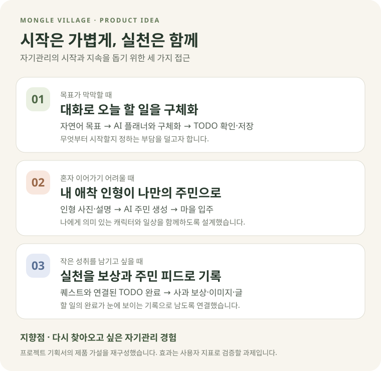
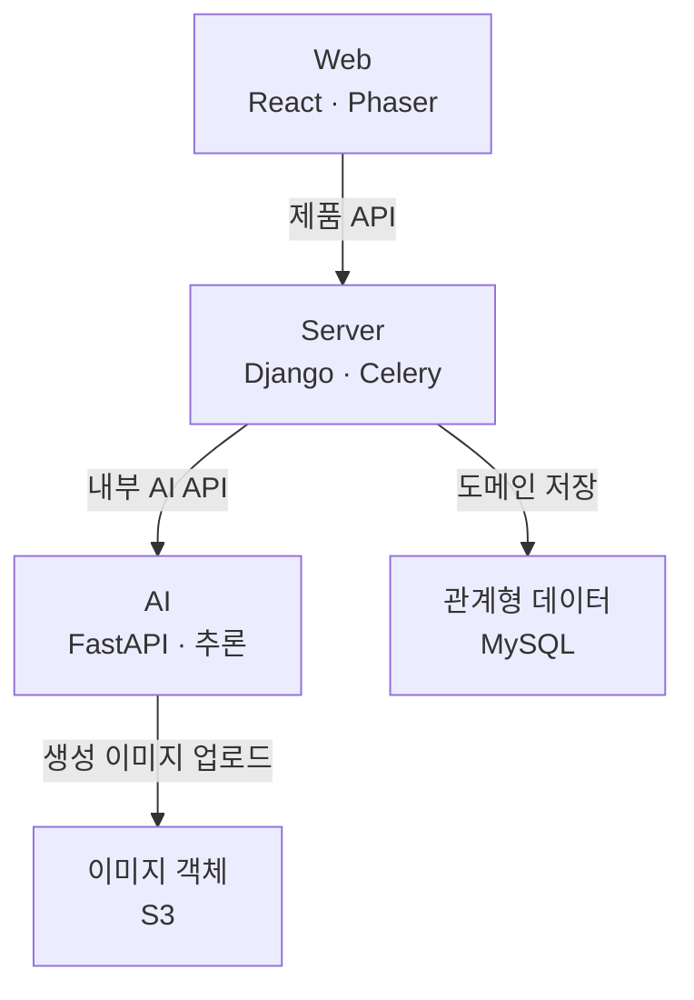
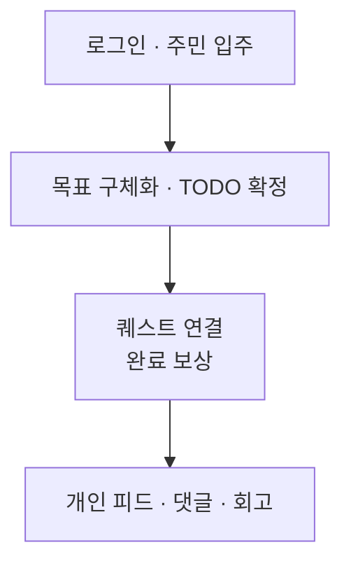

# 몽글마을 Web

> AI 주민과 함께 TODO를 퀘스트로 수행하는 픽셀 마을형 자기관리 웹 서비스

[](https://react.dev/)
[](https://www.typescriptlang.org/)
[](https://phaser.io/)
[](https://github.com/bigmooon/mongle-web/actions/workflows/ci.yml)

<p align="center">
  
</p>

<p align="center">
  
  
</p>

## 프로젝트 개요

**내일도와줘, 몽글마을**은 자기관리를 시작하고 싶지만 계획을 세우거나 꾸준히 실천하기 어려운 20~30대를 위한 서비스입니다. 나의 애착 인형을 픽셀 마을의 AI 주민으로 만들고, 자연어로 이야기한 목표를 실행할 TODO로 구체화합니다.

사용자는 계획을 확인하고 저장한 뒤, 자신의 할 일과 연결된 주민의 퀘스트를 함께 수행합니다. 퀘스트와 연결된 TODO를 완료하면 사과 토큰을 받고, 주민의 이미지·글이 담긴 개인 피드가 생성됩니다. 여기에 캘린더, 집중을 돕는 포모도로, 하루를 돌아보는 회고를 더해 **계획 → 실천 → 성취 기록**을 하나의 마을에서 경험하도록 구성했습니다.

몽글마을은 나만의 캐릭터와 작은 실천을 쌓으며 다시 찾아오고 싶은 자기관리 경험을 목표로 합니다. 대상 사용자와 제품의 출발점은 [프로젝트 기획서의 「핵심 목표·주요 고객」](https://drive.google.com/file/d/1AT0YGK2BfbWJpBcsvgHfugAlRHEdQTak/view)에 정리되어 있습니다.

Web은 이 경험을 React 인터페이스와 Phaser 마을 화면으로 구현합니다. 로그인, TODO, 캘린더, 피드, 회고는 React가 담당하고, Tiled 기반 픽셀 마을은 Phaser가 렌더링합니다. Zustand로 인증·알림 상태를 관리하며, Django API를 통해 AI 생성 결과를 받아 표시하고 캐릭터 생성 중 새로고침이 발생했을 때 작업 조회를 이어갑니다.

| 영역 | 저장소 |
| --- | --- |
| Web | **현재 저장소** |
| Server | [mongle-server](https://github.com/bigmooon/mongle-server) |
| AI | [mongle-ai](https://github.com/bigmooon/mongle-ai) |

## 문제 정의와 리서치 근거

기획서가 주목한 문제는 **자기관리의 의욕이 실제 시작과 지속으로 이어지기 어렵다는 점**입니다. 하고 싶은 일은 있어도 무엇부터 해야 할지 막막하고, 계획을 세운 뒤에도 혼자 반복하는 과정에서 흥미를 잃기 쉽습니다. 기획서에서는 이러한 어려움을 목표 구체화, 피드백, 보상과 연결해 풀고자 했습니다. [문제 정의와 서비스 필요성](https://drive.google.com/file/d/1AT0YGK2BfbWJpBcsvgHfugAlRHEdQTak/view)

몽글마을은 **쉽게 시작하기**와 **꾸준히 돌아오기**에 초점을 맞췄습니다. AI 플래너와 대화하며 목표를 작은 할 일로 나누고, 사용자가 확인한 계획부터 실천하도록 돕습니다. 여기에 애착 인형을 나만의 주민으로 만드는 경험과 퀘스트·사과 보상·주민 피드를 더했습니다. 내가 한 일을 캐릭터의 활동으로도 볼 수 있게 해, 다음 실천을 이어갈 동기를 만들고자 했습니다.



*프로젝트 기획서 1.3~1.4절과 2.1~2.3절을 바탕으로 재구성한 문제의식과 제품 접근입니다. 화면 구성은 [화면 설계서](https://drive.google.com/file/d/1YtJOZGWTRox2bAD4ejiBRfHChII9syMF/view), 사용 장면은 [시나리오 설계서](https://drive.google.com/file/d/1iEBtXu_PdO8v77O-_BnPvVMfbw2PgwJB/view)에서 확인할 수 있습니다.*

기획 단계에서 참고한 외부 조사 결과는 아래와 같습니다. 조사 대상과 조건이 서로 다른 선행 자료이며, 몽글마을 사용자를 대상으로 측정한 결과는 아닙니다. 원문 출처 목록은 [프로젝트 기획서의 「출처」](https://drive.google.com/file/d/1AT0YGK2BfbWJpBcsvgHfugAlRHEdQTak/view)에 있습니다.

| 관찰한 문제 | 조사 결과 | Web 경험에 반영한 방식 |
| --- | --- | --- |
| 시작 자체가 어렵다 | 귀찮음 **25.8%**, 무엇을 할지 모름 **24.4%**, 시간 부족 **21.7%** | 한 문장 입력과 대화형 플래너로 계획 시작 단계를 단축 |
| 생산성 앱을 오래 쓰기 어렵다 | 생산성 앱 리텐션: 1일 **32.86% → 30일 9.63%** | TODO를 캐릭터 퀘스트·보상·피드로 시각화 |
| 루틴을 돕는 디지털 수요가 있다 | 챌린지·습관 앱 이용 **21.3%** | 캘린더·포모도로·회고를 하나의 마을 경험으로 연결 |

이 자료를 바탕으로 “목표 구체화와 캐릭터 기반 보상이 시작과 재방문에 도움이 될 것”이라는 제품 가설을 세웠습니다. 실제 효과는 TODO 생성·완료율, 1·7·30일 재방문율, 회고 참여율 등으로 검증할 과제입니다. 상황별 응원이나 TODO와 퀘스트의 연결 조건 등 기획과 현재 구현이 달라진 부분은 [설계·구현 대조 기록](docs/CROSS_REPOSITORY_REVIEW.md)에 구분했습니다.

## 문서 기준과 변경 이력

README는 2026-10-10에 확인한 코드와 환경 변수 예시, Compose, CI 설정을 기준으로 작성했습니다. 코드 링크는 당시 커밋을 가리킵니다. Drive 설계 자료와 달라진 부분, 확인이 필요한 항목과 검증 내역은 [교차검증 기록](docs/CROSS_REPOSITORY_REVIEW.md)에서 확인할 수 있습니다.

## 관련 설계 문서

| 문서 | 확인할 수 있는 내용 |
| --- | --- |
| [프로젝트 기획서](https://drive.google.com/file/d/1AT0YGK2BfbWJpBcsvgHfugAlRHEdQTak/view) | 문제 정의, 시장·사용자 리서치와 제품 가설 |
| [화면 설계서](https://drive.google.com/file/d/1YtJOZGWTRox2bAD4ejiBRfHChII9syMF/view) | 주요 화면, 사용자 동선과 UI 구성 |
| [시나리오 설계서](https://drive.google.com/file/d/1iEBtXu_PdO8v77O-_BnPvVMfbw2PgwJB/view) | 핵심 사용 시나리오와 기능 흐름 |
| [요구사항 정의서](https://drive.google.com/file/d/1ineMQiAB7cdMCnDCzvfNJTvKYgrsaKHC/view) | 기능·비기능 요구사항 |
| [시스템 아키텍처](https://drive.google.com/file/d/15p49ZUIrJCmrSCy3LpU3FbjapZaMXdRc/view) | Web·Server·AI 간 구성과 배포 경계 |

[전체 프로젝트 산출물 보기](https://drive.google.com/drive/folders/1Lfv49TDbilo4ivoSIpw4v8RDEnEw9quC)

## 시스템 구조

Web은 Django API를 호출해 화면에 결과를 표시하고 작업 상태를 복구합니다. Django가 사용자 데이터를 저장하고 AI 서비스에 생성을 요청합니다.



Web의 AI 기능 요청은 Django를 거쳐 FastAPI로 전달됩니다. 원본 사진은 Django가 발급한 presigned URL로 Web이 S3에 직접 PUT하며, Django는 이미지 키·메타데이터와 캐릭터 생성 감사 JSON을 관리합니다. AI가 결과를 HTTP 응답/폴링 결과로 반환하면 Django가 도메인 DB에 반영합니다. S3는 Web 정적 파일 배포와 사용자 미디어 저장에 각각 사용합니다.

Redis는 Server의 Celery broker/result 및 인증 캐시이고, AI job·플래너 대화는 별도 메모리 상태입니다. 제품 DB는 MySQL을 사용하도록 구성되어 있고, Django 기본 설정에서는 `DATABASE_URL`을 지정하지 않으면 SQLite를 사용합니다. [설정 근거](https://github.com/bigmooon/mongle-server/blob/11f428734960dab8db60bc5bc7128fb62e8a495d/config/settings/base.py).

관련 코드: [src/shared/api/client.ts](https://github.com/bigmooon/mongle-web/blob/fcd2734b386035fca2d10980a1bb55ec8e90c4ba/src/shared/api/client.ts) · [src/features/character/api.ts](https://github.com/bigmooon/mongle-web/blob/fcd2734b386035fca2d10980a1bb55ec8e90c4ba/src/features/character/api.ts) · [apps/characters/tasks.py](https://github.com/bigmooon/mongle-server/blob/11f428734960dab8db60bc5bc7128fb62e8a495d/apps/characters/tasks.py) · [infrastructure/storage/s3.py](https://github.com/bigmooon/mongle-server/blob/11f428734960dab8db60bc5bc7128fb62e8a495d/infrastructure/storage/s3.py) · [api/deps.py](https://github.com/bigmooon/mongle-ai/blob/8f897687560a6ebf179e3a0894a3bfd05b778efc/api/deps.py)

## 주요 사용자 경험



포모도로는 실행 중 독립적으로 사용하는 로컬 타이머입니다. 피드 생성 완료를 기다려야 포모도로·회고를 사용할 수 있는 순차 의존 관계는 없습니다. 아래 Server 경로의 공통 prefix는 `/api/v1`입니다.

| 단계 | Web 담당 | Server API·저장 | AI·경계 및 근거 |
| --- | --- | --- | --- |
| 로그인·세션 복구 | `auth/store.ts`, `auth/api.ts`, `shared/api/client.ts` | `POST /auth/login`, `/auth/token/refresh`; `GET /auth/me/`; Kakao 교환·가입 보완 | AI 미호출<br/>[src/features/auth/store.ts](https://github.com/bigmooon/mongle-web/blob/fcd2734b386035fca2d10980a1bb55ec8e90c4ba/src/features/auth/store.ts) · [apps/users/urls.py](https://github.com/bigmooon/mongle-server/blob/11f428734960dab8db60bc5bc7128fb62e8a495d/apps/users/urls.py) · [apps/users/refresh_token_service.py](https://github.com/bigmooon/mongle-server/blob/11f428734960dab8db60bc5bc7128fb62e8a495d/apps/users/refresh_token_service.py) |
| 사진·AI 주민 생성 | `character/api.ts`, `pendingJob.ts`, `App.tsx` | 원본 presign → S3 PUT → 생성 job 제출·조회 → `POST /characters/` 입주 | `/v1/character` → persona·이미지·외형 결과<br/>[src/features/character/api.ts](https://github.com/bigmooon/mongle-web/blob/fcd2734b386035fca2d10980a1bb55ec8e90c4ba/src/features/character/api.ts) · [apps/characters/views.py](https://github.com/bigmooon/mongle-server/blob/11f428734960dab8db60bc5bc7128fb62e8a495d/apps/characters/views.py) · [api/character_creation/router.py](https://github.com/bigmooon/mongle-ai/blob/8f897687560a6ebf179e3a0894a3bfd05b778efc/api/character_creation/router.py) |
| 자연어 목표·계획 구체화 | `todo/todoApi.ts`, `planner-chat/plannerApi.ts` | `/todos/generate/`, `/todos/chat/` 및 job 조회 | 단일 분해 또는 후속 질문·계획 후보. 생성만으로 DB에 저장하지 않음<br/>[src/features/planner-chat/plannerApi.ts](https://github.com/bigmooon/mongle-web/blob/fcd2734b386035fca2d10980a1bb55ec8e90c4ba/src/features/planner-chat/plannerApi.ts) · [apps/todos/ai_client.py](https://github.com/bigmooon/mongle-server/blob/11f428734960dab8db60bc5bc7128fb62e8a495d/apps/todos/ai_client.py) · [agents/todo_creation/planner/pipeline.py](https://github.com/bigmooon/mongle-ai/blob/8f897687560a6ebf179e3a0894a3bfd05b778efc/agents/todo_creation/planner/pipeline.py) |
| TODO·캘린더·태그 저장 | TODO 확정, 플래너 확정, `calendar/CalendarModal.tsx` | `/todos/confirm/`, `/todos/planner-confirm/`, `/todos/`, `/schedules/`, `/calendar/`, `/tags/` | 계획 확정은 Django가 오늘 후보를 Todo, 다른 날짜 후보를 Schedule로 저장; AI `/commit`은 이 제품 경로에서 호출하지 않음<br/>[apps/todos/views.py](https://github.com/bigmooon/mongle-server/blob/11f428734960dab8db60bc5bc7128fb62e8a495d/apps/todos/views.py) · [apps/todos/schedule_urls.py](https://github.com/bigmooon/mongle-server/blob/11f428734960dab8db60bc5bc7128fb62e8a495d/apps/todos/schedule_urls.py) · [src/features/calendar/CalendarModal.tsx](https://github.com/bigmooon/mongle-web/blob/fcd2734b386035fca2d10980a1bb55ec8e90c4ba/src/features/calendar/CalendarModal.tsx) |
| 캐릭터 퀘스트 배정 | `previewTodoQuests`, TODO·플래너 확정 UI | `/todos/quest-preview/` 또는 확정 중 `_assign_quests_to_todos` | `/v1/quest/generate`; TODO **ID**와 캐릭터 정보로 매핑. TODO 내용은 LLM에 전달하지 않음<br/>[apps/todos/views.py](https://github.com/bigmooon/mongle-server/blob/11f428734960dab8db60bc5bc7128fb62e8a495d/apps/todos/views.py) · [agents/quest_generation/pipeline.py](https://github.com/bigmooon/mongle-ai/blob/8f897687560a6ebf179e3a0894a3bfd05b778efc/agents/quest_generation/pipeline.py) |
| 완료·보상 | `completeTodo`, App/캘린더 상태 갱신 | `PATCH /todos/{id}/complete/` → Todo·Quest 완료, 잔액·거래 기록 → DB commit 후 피드 예약 | 피드 생성은 완료 응답과 분리<br/>[src/features/todo/todoApi.ts](https://github.com/bigmooon/mongle-web/blob/fcd2734b386035fca2d10980a1bb55ec8e90c4ba/src/features/todo/todoApi.ts) · [apps/todos/views.py](https://github.com/bigmooon/mongle-server/blob/11f428734960dab8db60bc5bc7128fb62e8a495d/apps/todos/views.py) |
| AI 이미지·캡션 | 생성된 피드·알림을 조회 | Celery `generate_feed_post` → AI 호출 → Post 저장·알림 생성 | `/v1/feed/generate`: 장면 프롬프트 → 이미지 → S3 → 캡션 → 결과<br/>[apps/posts/tasks.py](https://github.com/bigmooon/mongle-server/blob/11f428734960dab8db60bc5bc7128fb62e8a495d/apps/posts/tasks.py) · [agents/feed_generation/pipeline.py](https://github.com/bigmooon/mongle-ai/blob/8f897687560a6ebf179e3a0894a3bfd05b778efc/agents/feed_generation/pipeline.py) |
| 피드·댓글·답글 | `feed/api.ts`, `FeedModal.tsx`, `PostScreen.tsx` | `/posts/`, `/posts/{id}/comments/`, `/posts/{id}/like/`; 댓글 commit 후 600초 지연 예약 | `/v1/reply/generate` → Reply 저장. 자기 캐릭터의 개인 피드<br/>[src/features/feed/api.ts](https://github.com/bigmooon/mongle-web/blob/fcd2734b386035fca2d10980a1bb55ec8e90c4ba/src/features/feed/api.ts) · [apps/posts/views.py](https://github.com/bigmooon/mongle-server/blob/11f428734960dab8db60bc5bc7128fb62e8a495d/apps/posts/views.py) · [apps/posts/tasks.py](https://github.com/bigmooon/mongle-server/blob/11f428734960dab8db60bc5bc7128fb62e8a495d/apps/posts/tasks.py) |
| 포모도로 | `pomodoro/PomodoroHud.tsx`: 25분/5분, 종료 시 다음 모드에서 정지 | 서버 API·집중 이력 DB 저장 없음 | AI 미호출; `localStorage`의 종료 시각으로 복원<br/>[src/features/pomodoro/PomodoroHud.tsx](https://github.com/bigmooon/mongle-web/blob/fcd2734b386035fca2d10980a1bb55ec8e90c4ba/src/features/pomodoro/PomodoroHud.tsx) |
| 회고 | `reflection/api.ts`: 당일 문맥·과거 회고 조회, 작성·수정 | `/reflections/context/{date}/`, `/reflections/`, `/{id}/`; Reflection·보상 거래 저장 | AI 미호출<br/>[src/features/reflection/api.ts](https://github.com/bigmooon/mongle-web/blob/fcd2734b386035fca2d10980a1bb55ec8e90c4ba/src/features/reflection/api.ts) · [apps/todos/reflection_views.py](https://github.com/bigmooon/mongle-server/blob/11f428734960dab8db60bc5bc7128fb62e8a495d/apps/todos/reflection_views.py) |

### 작업별 통신 방식

| 작업 | Web → Django | Django → AI | 실행·상태 책임 |
| --- | --- | --- | --- |
| 캐릭터 | `POST /characters/generation-jobs/` → 202; `GET /characters/generation-jobs/{id}/` | Celery가 `POST /v1/character` → 202 후 `GET /v1/character/{id}` 폴링 | Django `CharacterGenerationJob` DB 상태 + AI 메모리 job. 성공 후 사용자의 `POST /characters/`로 입주 |
| 단일 TODO 후보 | `POST /todos/generate/`의 최종 응답 대기 | Django 요청 안에서 `POST /v1/todo/generate` 및 `GET /v1/todo/generate/{id}` | Celery 없음. Web에 job ID를 노출하는 방식이 아님 |
| 멀티턴 플래너 | `POST /todos/chat/` → 202; `GET /todos/chat/{id}/` 폴링 | Django가 `/v1/todo/chat` 제출·조회 중계 | AI 메모리 job·플래너 체크포인트. Django DB job 없음 |
| 퀘스트 | 미리보기·확정 API의 최종 응답 대기 | Django 요청 안에서 `/v1/quest/generate` 제출·조회 | Celery 없음. 결과의 유효한 매핑을 Django가 저장 |
| 피드·답글 | TODO 완료·댓글 등록 후 게시물 재조회 | Celery가 `POST /v1/feed/generate`, `/v1/reply/generate` 결과 대기 | Web 관점 백그라운드, AI API 관점 단일 요청/응답. 별도 feed job 조회 API 없음 |

Web → Django 경로에는 `/api/v1`을 앞에 붙입니다. 캐릭터의 Server job ID와 AI job ID는 서로 다르며, 플래너는 AI job ID를 중계합니다. **Submit/Poll이 곧 Celery 사용이나 영속 복구를 뜻하지는 않습니다.**

관련 코드: [apps/todos/views.py](https://github.com/bigmooon/mongle-server/blob/11f428734960dab8db60bc5bc7128fb62e8a495d/apps/todos/views.py) · [apps/todos/ai_client.py](https://github.com/bigmooon/mongle-server/blob/11f428734960dab8db60bc5bc7128fb62e8a495d/apps/todos/ai_client.py) · [apps/characters/tasks.py](https://github.com/bigmooon/mongle-server/blob/11f428734960dab8db60bc5bc7128fb62e8a495d/apps/characters/tasks.py) · [apps/posts/tasks.py](https://github.com/bigmooon/mongle-server/blob/11f428734960dab8db60bc5bc7128fb62e8a495d/apps/posts/tasks.py) · [api/todo_creation/router.py](https://github.com/bigmooon/mongle-ai/blob/8f897687560a6ebf179e3a0894a3bfd05b778efc/api/todo_creation/router.py) · [api/quest_generation/router.py](https://github.com/bigmooon/mongle-ai/blob/8f897687560a6ebf179e3a0894a3bfd05b778efc/api/quest_generation/router.py)

### 화면·상태와 복구 범위

`main.tsx`가 `ErrorBoundary → MobileGate → RouteGate → App`을 조립합니다. React Router 기반의 화면별 라우팅이 아니라 `App.tsx`의 HUD·모달 상태와 `featureRegistry.ts`로 기능을 엽니다. `RouteGate`는 루트·index·Kakao 콜백 등 허용 경로를 검사하며, Phaser는 마을 캔버스를 담당합니다. 인증·알림은 Zustand, 모달·후보·플래너 대화는 컴포넌트 상태를 사용합니다.

관련 코드: [src/main.tsx](https://github.com/bigmooon/mongle-web/blob/fcd2734b386035fca2d10980a1bb55ec8e90c4ba/src/main.tsx) · [src/app/routeMatch.ts](https://github.com/bigmooon/mongle-web/blob/fcd2734b386035fca2d10980a1bb55ec8e90c4ba/src/app/routeMatch.ts) · [src/app/App.tsx](https://github.com/bigmooon/mongle-web/blob/fcd2734b386035fca2d10980a1bb55ec8e90c4ba/src/app/App.tsx) · [src/app/featureRegistry.ts](https://github.com/bigmooon/mongle-web/blob/fcd2734b386035fca2d10980a1bb55ec8e90c4ba/src/app/featureRegistry.ts) · [src/features/notification/store.ts](https://github.com/bigmooon/mongle-web/blob/fcd2734b386035fca2d10980a1bb55ec8e90c4ba/src/features/notification/store.ts)

| 상태 | 저장·복구 방식 | 실패 시 동작과 한계 |
| --- | --- | --- |
| 로그인 | Access JWT는 Zustand와 `sessionStorage`; 재진입 시 `/auth/me/` 또는 Refresh 쿠키로 복구 | 401 요청은 공유 Refresh promise 후 한 번 재전송. 선제 갱신은 만료 60초 전·탭 복귀·online에서 시도하며 일시 실패 시 30초 후 재시도. 초기 복구 실패나 401 interceptor 갱신 실패는 세션 초기화 가능 |
| 캐릭터 생성 | `localStorage`에 job ID·이름·persona 저장, 재진입 시 같은 job의 미리보기 복원 | 2초 간격, 6분 제한, 조회당 15초 제한. 네트워크/5xx는 연속 3회 오류까지 처리. 타임아웃·관찰 중단은 pending 유지; FAILED·CONSUMED·복구 조회 404는 정리 |
| 캐릭터 입주·취소 | SUCCEEDED는 미리보기이며 사용자가 입주를 눌러야 등록 | 관찰 중단은 서버 취소와 다름. 취소 API는 결과 폐기·횟수 환불용이며 이미 실행된 원격 GPU 작업 중단을 보장하지 않음 |
| 플래너 | React 상태의 대화·thread ID; 작업 폴링은 2초 간격·10분 제한 | 캐릭터와 같은 pending 영속 복구 없음. AI 재시작 시 job·대화 체크포인트도 유실 |
| 포모도로 | `pomodoro_hud` 로컬 저장과 `endAt`으로 남은 시간 복원 | 로그인 조건에 따라 재개, 로그아웃 시 초기화. 서버에 집중 기록을 보내지 않음 |

관련 코드: [src/features/auth/store.ts](https://github.com/bigmooon/mongle-web/blob/fcd2734b386035fca2d10980a1bb55ec8e90c4ba/src/features/auth/store.ts) · [src/shared/api/client.ts](https://github.com/bigmooon/mongle-web/blob/fcd2734b386035fca2d10980a1bb55ec8e90c4ba/src/shared/api/client.ts) · [src/features/character/api.ts](https://github.com/bigmooon/mongle-web/blob/fcd2734b386035fca2d10980a1bb55ec8e90c4ba/src/features/character/api.ts) · [src/features/character/pendingJob.ts](https://github.com/bigmooon/mongle-web/blob/fcd2734b386035fca2d10980a1bb55ec8e90c4ba/src/features/character/pendingJob.ts) · [src/features/planner-chat/plannerChat.tsx](https://github.com/bigmooon/mongle-web/blob/fcd2734b386035fca2d10980a1bb55ec8e90c4ba/src/features/planner-chat/plannerChat.tsx) · [src/features/planner-chat/plannerApi.ts](https://github.com/bigmooon/mongle-web/blob/fcd2734b386035fca2d10980a1bb55ec8e90c4ba/src/features/planner-chat/plannerApi.ts) · [src/features/pomodoro/PomodoroHud.tsx](https://github.com/bigmooon/mongle-web/blob/fcd2734b386035fca2d10980a1bb55ec8e90c4ba/src/features/pomodoro/PomodoroHud.tsx)

피드는 서버에서 받은 개인 게시물 배열을 클라이언트에서 나눠 보여줍니다. 설계서의 서버 페이지네이션·전체 사용자 좋아요 집계와 동일한 구현으로 설명하지 않습니다. 공유는 Kakao SDK 또는 브라우저 공유 기능·링크 복사로 처리하며, Instagram Stories 전용 게시 API는 구현되어 있지 않습니다.

관련 코드: [src/features/feed/FeedModal.tsx](https://github.com/bigmooon/mongle-web/blob/fcd2734b386035fca2d10980a1bb55ec8e90c4ba/src/features/feed/FeedModal.tsx) · [src/features/feed/share.ts](https://github.com/bigmooon/mongle-web/blob/fcd2734b386035fca2d10980a1bb55ec8e90c4ba/src/features/feed/share.ts) · [apps/posts/views.py](https://github.com/bigmooon/mongle-server/blob/11f428734960dab8db60bc5bc7128fb62e8a495d/apps/posts/views.py) · [apps/posts/models.py](https://github.com/bigmooon/mongle-server/blob/11f428734960dab8db60bc5bc7128fb62e8a495d/apps/posts/models.py)

## 담당한 부분

기능 구현뿐 아니라 화면 구조, API 연동, 비동기 상태 복구와 품질 자동화를 함께 담당했습니다. 아래 항목은 병합된 PR로 확인할 수 있습니다.

- **품질 기반**: Biome, TypeScript 검사와 CI 흐름을 구성했습니다. ([#3](https://github.com/mong-studio/mongle-web/pull/3))
- **인증 경험**: 로그인·세션 처리와 카카오 로그인을 구현했습니다. ([#9](https://github.com/mong-studio/mongle-web/pull/9), [#100](https://github.com/mong-studio/mongle-web/pull/100))
- **화면 구조**: 기능 단위 디렉터리와 공용 모듈 경계를 정리했습니다. ([#32](https://github.com/mong-studio/mongle-web/pull/32), [#38](https://github.com/mong-studio/mongle-web/pull/38))
- **AI 작업 UX**: 캐릭터 생성의 비동기 처리와 새로고침 이후 pending job 복구를 구현했습니다. ([#61](https://github.com/mong-studio/mongle-web/pull/61))
- **TODO·캘린더**: 태그 기반 일정과 TODO 화면을 구현했습니다. ([#76](https://github.com/mong-studio/mongle-web/pull/76), [#104](https://github.com/mong-studio/mongle-web/pull/104), [#175](https://github.com/mong-studio/mongle-web/pull/175))
- **피드 안정성**: 좋아요 동기화와 댓글 입력 정책을 테스트 가능한 규칙으로 분리했습니다. ([#132](https://github.com/mong-studio/mongle-web/pull/132))
- **온보딩**: 실제 서비스 화면을 따라가는 튜토리얼을 추가했습니다. ([#155](https://github.com/mong-studio/mongle-web/pull/155))

## 기술적 선택

| 문제 | 선택 | 이유 |
| --- | --- | --- |
| 정보 UI와 게임형 공간을 함께 표현 | React UI + Phaser Canvas | 폼·모달의 생산성과 픽셀 마을 렌더링을 동시에 확보하기 위해 |
| 기능 증가에 따른 결합도 | `features/` 중심 구조 | 인증·캘린더·피드 등 도메인 변경 범위를 제한하기 위해 |
| AI 생성 중 새로고침·지연 | Submit/Poll + pending job 복구 | 장시간 요청의 타임아웃과 작업 유실을 줄이기 위해 |
| Refresh 쿠키의 브라우저 정책 | same-origin API + Vite proxy | 개발 시 쿠키 전달을 단순화하기 위해. 운영 API 호스트는 `VITE_API_BASE`에 따라 달라짐 |
| 피드의 낙관적 상호작용 | 서버 응답과 로컬 상태 동기화 | 좋아요·댓글 수가 화면마다 달라지는 문제를 줄이기 위해 |

## 검증 결과

2026-10-10에 기록한 로컬 검증 결과입니다. 이번 README 수정에서는 애플리케이션 테스트를 다시 실행하지 않았습니다.

| 검증 | 결과 |
| --- | --- |
| Vitest | 121 tests passed |
| TypeScript | `tsc --noEmit` 통과 |
| Production build | 통과 |
| Biome | unused import 경고 2건 확인 |

CI workflow는 Biome, 타입 검사, 테스트와 프로덕션 빌드를 순서대로 실행하도록 구성되어 있습니다.

## 빠른 시작

### 요구 환경

- Node.js 24 권장 — CI 기준
- npm 10+

```bash
git clone https://github.com/bigmooon/mongle-web.git
cd mongle-web
cp .env.example .env
npm ci
npm run dev
```

브라우저에서 `http://127.0.0.1:5173`을 엽니다. `VITE_API_BASE`를 비워 두면 `/api` 요청은 개발 프록시를 통해 `http://localhost:8000`으로 전달됩니다. (근거: [`vite.config.ts`](vite.config.ts))

### 환경 변수

| 이름 | 용도 |
| --- | --- |
| `VITE_API_BASE` | API 호스트. 비워 두면 same-origin 사용 |
| `VITE_KAKAO_JS_KEY` | Kakao JavaScript SDK 키 |
| `VITE_KAKAO_CLIENT_ID` | Kakao REST API 앱 키 |
| `VITE_KAKAO_REDIRECT_URI` | OAuth 콜백 URL |

### 검증

```bash
npm run check
npm run typecheck
npm run test
npm run build
```

## 구조

```text
src/
├── app/                  앱 셸과 기능 레지스트리
├── features/
│   ├── auth/             로그인·회원가입·카카오 인증
│   ├── calendar/         일정·태그·날짜 UI
│   ├── character/        AI 주민 생성과 작업 폴링
│   ├── feed/             게시물·댓글·공유
│   ├── planner-chat/     멀티턴 AI 플래너
│   ├── reflection/       일일 회고
│   ├── todo/             TODO와 퀘스트 UI
│   └── village/          Phaser 마을 화면
└── shared/               공용 API와 UI
```

상세한 설치·구조·품질 규칙은 [`docs/`](docs/)에서 확인할 수 있습니다.

## 배포

| 서비스 | 저장소에 정의된 배포·통신 경로 |
| --- | --- |
| Web | Node 빌드 → S3 정적 배포 → CloudFront invalidation. 개발은 Vite `/api` proxy → `localhost:8000`; 배포는 빌드 시 `VITE_API_BASE` 주입 |
| Server | 테스트 → Docker Hub → AWS OIDC·SSM → EC2 Compose. Nginx TLS → `web:8000` Gunicorn → Django. DB 주소는 `DATABASE_URL`, AI 주소는 아래 두 설정군 사용 |
| AI API | 테스트 → Docker Hub → RunPod CPU Pod 재시작 → `8010/health` 확인. Compose의 단독 API 실행과 GPU 워커는 별도 구성 |
| 추론 워커 | LLM·플래너·이미지 Docker 이미지 빌드. `v*` 태그 workflow에서 RunPod 템플릿 갱신. FastAPI가 RunPod endpoint를 호출하고 결과를 수집 |

Server의 TODO·퀘스트는 `MONGLE_AI_API_BASE`/`MONGLE_AI_API_KEY`, 캐릭터·피드·답글은 `AI_SERVICE_URL`/`AI_SERVICE_TOKEN`을 사용합니다. 두 키는 연결할 AI의 `MONGLE_API_KEY`와 맞춰야 합니다. 컨테이너에서 호스트 AI에 연결할 때 loopback 대신 도달 가능한 호스트 주소를 설정해야 합니다.

배포 경로는 저장소의 Compose와 CI 설정을 기준으로 정리했습니다. 실제 DNS, CloudFront origin, RDS 엔진 버전, RunPod에서 사용 중인 모델과 비밀 환경 변수는 운영 환경에서 별도로 확인해야 합니다. Nginx 대기 제한(120초), Server AI 폴링 기본 예산(150초), Gunicorn 제한(180초)이 달라 동기 대기 경로의 타임아웃 위험도 남아 있습니다.

관련 코드: [.github/workflows/deploy-web.yml](https://github.com/bigmooon/mongle-web/blob/fcd2734b386035fca2d10980a1bb55ec8e90c4ba/.github/workflows/deploy-web.yml) · [vite.config.ts](https://github.com/bigmooon/mongle-web/blob/fcd2734b386035fca2d10980a1bb55ec8e90c4ba/vite.config.ts) · [.github/workflows/deploy-server.yml](https://github.com/bigmooon/mongle-server/blob/11f428734960dab8db60bc5bc7128fb62e8a495d/.github/workflows/deploy-server.yml) · [nginx/api.conf](https://github.com/bigmooon/mongle-server/blob/11f428734960dab8db60bc5bc7128fb62e8a495d/nginx/api.conf) · [Dockerfile](https://github.com/bigmooon/mongle-server/blob/11f428734960dab8db60bc5bc7128fb62e8a495d/Dockerfile) · [.env.example](https://github.com/bigmooon/mongle-server/blob/11f428734960dab8db60bc5bc7128fb62e8a495d/.env.example) · [.github/workflows/deploy-api.yml](https://github.com/bigmooon/mongle-ai/blob/8f897687560a6ebf179e3a0894a3bfd05b778efc/.github/workflows/deploy-api.yml) · [.github/workflows/deploy-workers.yml](https://github.com/bigmooon/mongle-ai/blob/8f897687560a6ebf179e3a0894a3bfd05b778efc/.github/workflows/deploy-workers.yml) · [docker-compose.yml](https://github.com/bigmooon/mongle-ai/blob/8f897687560a6ebf179e3a0894a3bfd05b778efc/docker-compose.yml)

## 한계와 다음 과제

- 초기 JavaScript 번들이 커서 기능 단위 lazy loading이 필요합니다.
- 일부 Phaser 상호작용은 임시 클릭 지점을 사용합니다.
- 플레이어 이동, 충돌, 오디오와 멀티플레이는 현재 범위에 포함되지 않습니다.
- 접근성과 모바일 레이아웃에 대한 별도 E2E 검증이 필요합니다.
