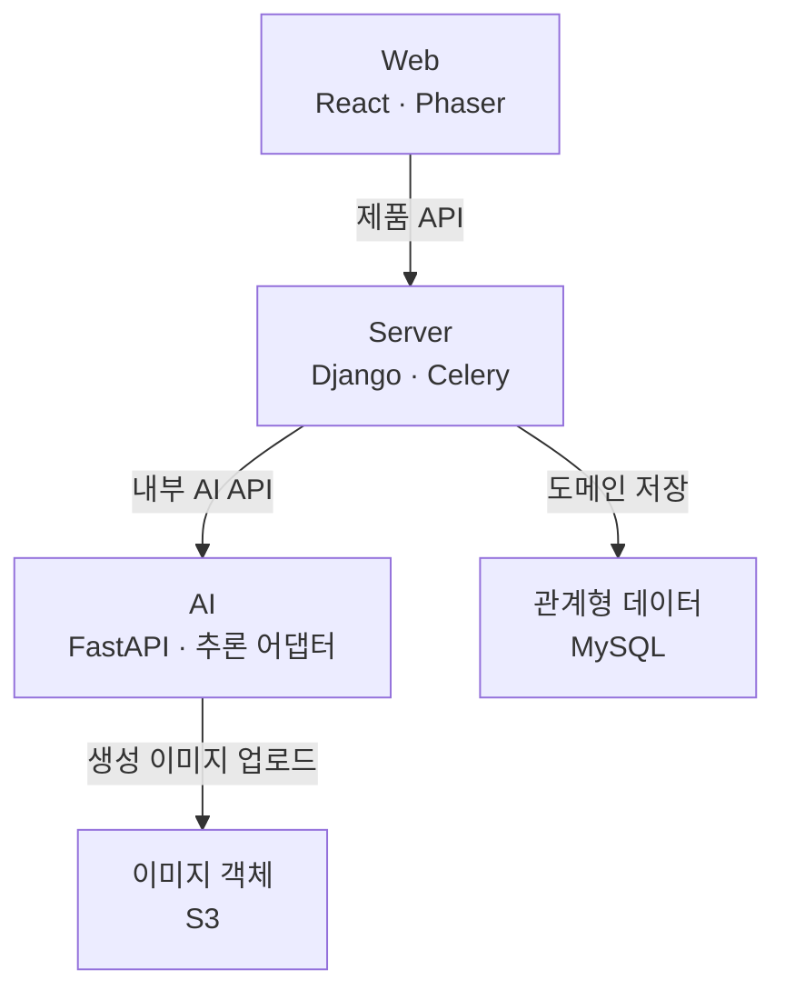

# 몽글마을 Web·Server·AI README 교차검증

검토일: 2026-10-10. 소스 정적 검토 기준이며 실제 운영 서버·GPU·RDS 접속 검증이나 성능 재측정 결과가 아니다. 코드는 변경하지 않았고 README와 이 근거 기록만 수정한다.

## 기준 커밋

- web: [fcd2734b386035fca2d10980a1bb55ec8e90c4ba](https://github.com/bigmooon/mongle-web/tree/fcd2734b386035fca2d10980a1bb55ec8e90c4ba)
- server: [11f428734960dab8db60bc5bc7128fb62e8a495d](https://github.com/bigmooon/mongle-server/tree/11f428734960dab8db60bc5bc7128fb62e8a495d)
- ai: [8f897687560a6ebf179e3a0894a3bfd05b778efc](https://github.com/bigmooon/mongle-ai/tree/8f897687560a6ebf179e3a0894a3bfd05b778efc)

## 먼저 확인한 점검 결과

| 항목 | 현재 README | 실제 구현 | 판정 | 수정 방향·근거 |
| --- | --- | --- | --- | --- |
| Web 진입·화면 | React/Phaser·features 요약 | main → ErrorBoundary·MobileGate·RouteGate·App, 모달 기반 | 일치·상세 누락 | [src/main.tsx](https://github.com/bigmooon/mongle-web/blob/fcd2734b386035fca2d10980a1bb55ec8e90c4ba/src/main.tsx) · [src/app/RouteGate.tsx](https://github.com/bigmooon/mongle-web/blob/fcd2734b386035fca2d10980a1bb55ec8e90c4ba/src/app/RouteGate.tsx) |
| 비동기 경로 | Celery와 Submit/Poll 포괄 | 캐릭터·피드·답글만 Celery, TODO·퀘스트는 요청 내부 대기, chat은 중계 | 부정확 | 작업별 표로 분리. [apps/todos/ai_client.py](https://github.com/bigmooon/mongle-server/blob/11f428734960dab8db60bc5bc7128fb62e8a495d/apps/todos/ai_client.py) · [apps/posts/tasks.py](https://github.com/bigmooon/mongle-server/blob/11f428734960dab8db60bc5bc7128fb62e8a495d/apps/posts/tasks.py) |
| 입주 | 생성 흐름 요약 | SUCCEEDED 미리보기 후 별도 등록·CONSUMED | 단계 누락 | [src/features/character/api.ts](https://github.com/bigmooon/mongle-web/blob/fcd2734b386035fca2d10980a1bb55ec8e90c4ba/src/features/character/api.ts) · [apps/characters/views.py](https://github.com/bigmooon/mongle-server/blob/11f428734960dab8db60bc5bc7128fb62e8a495d/apps/characters/views.py) |
| 인증 | JWT 갱신 | Access JWT + opaque Refresh 해시/회전 | 상세 누락 | [apps/users/refresh_token_service.py](https://github.com/bigmooon/mongle-server/blob/11f428734960dab8db60bc5bc7128fb62e8a495d/apps/users/refresh_token_service.py) · [src/features/auth/store.ts](https://github.com/bigmooon/mongle-web/blob/fcd2734b386035fca2d10980a1bb55ec8e90c4ba/src/features/auth/store.ts) |
| 복구 | AI 작업 UX 일반화 | 캐릭터 pending은 localStorage, 플래너는 React·AI 메모리 | 범위 제한 | [src/features/character/pendingJob.ts](https://github.com/bigmooon/mongle-web/blob/fcd2734b386035fca2d10980a1bb55ec8e90c4ba/src/features/character/pendingJob.ts) · [agents/todo_creation/planner/graph.py](https://github.com/bigmooon/mongle-ai/blob/8f897687560a6ebf179e3a0894a3bfd05b778efc/agents/todo_creation/planner/graph.py) |
| 영속화 | MySQL·S3 묶음 | Django DB·presign·감사 JSON, Web PUT, AI 이미지 업로드 | 주체 누락 | [apps/characters/tasks.py](https://github.com/bigmooon/mongle-server/blob/11f428734960dab8db60bc5bc7128fb62e8a495d/apps/characters/tasks.py) · [agents/feed_generation/nodes/s3_upload.py](https://github.com/bigmooon/mongle-ai/blob/8f897687560a6ebf179e3a0894a3bfd05b778efc/agents/feed_generation/nodes/s3_upload.py) |
| TODO 저장 | 생성·저장 요약 | 후보/확정 분리; planner-confirm은 오늘 Todo·다른 날짜 Schedule | 단계 누락 | [apps/todos/views.py](https://github.com/bigmooon/mongle-server/blob/11f428734960dab8db60bc5bc7128fb62e8a495d/apps/todos/views.py) |
| 퀘스트 | TODO를 퀘스트로 | ID 연결, 내용 미전달, 캐릭터 persona 기반 | 설명 보완 | [agents/quest_generation/schemas.py](https://github.com/bigmooon/mongle-ai/blob/8f897687560a6ebf179e3a0894a3bfd05b778efc/agents/quest_generation/schemas.py) · [apps/todos/views.py](https://github.com/bigmooon/mongle-server/blob/11f428734960dab8db60bc5bc7128fb62e8a495d/apps/todos/views.py) |
| 보상·피드 | 완료 후 피드 | DB commit 후 Celery 예약, 결과 수신 후 Post 저장 | 순서 누락 | [apps/todos/views.py](https://github.com/bigmooon/mongle-server/blob/11f428734960dab8db60bc5bc7128fb62e8a495d/apps/todos/views.py) · [apps/posts/tasks.py](https://github.com/bigmooon/mongle-server/blob/11f428734960dab8db60bc5bc7128fb62e8a495d/apps/posts/tasks.py) |
| 재시도 | 안정적 처리 | 캐릭터 자동 retry 호출 없음; 피드/답글 HTTP 실패 retry | 과장 방지 | [apps/characters/tasks.py](https://github.com/bigmooon/mongle-server/blob/11f428734960dab8db60bc5bc7128fb62e8a495d/apps/characters/tasks.py) · [apps/posts/tasks.py](https://github.com/bigmooon/mongle-server/blob/11f428734960dab8db60bc5bc7128fb62e8a495d/apps/posts/tasks.py) |
| 주기 작업 | Celery 주기 작업 | 스케줄만 있고 Compose에 Beat 없음 | 가동 미확인 | [config/settings/base.py](https://github.com/bigmooon/mongle-server/blob/11f428734960dab8db60bc5bc7128fb62e8a495d/config/settings/base.py) · [docker-compose.prod.yml](https://github.com/bigmooon/mongle-server/blob/11f428734960dab8db60bc5bc7128fb62e8a495d/docker-compose.prod.yml) |
| 인프라 버전 | MySQL 8.4·Redis 8 | CI 8.4/8, 로컬 Compose 9.7/7, 운영 Redis 7 | 불일치 | 실제 설정값 각각 명시. [docker-compose.yml](https://github.com/bigmooon/mongle-server/blob/11f428734960dab8db60bc5bc7128fb62e8a495d/docker-compose.yml) · [.github/workflows/ci.yml](https://github.com/bigmooon/mongle-server/blob/11f428734960dab8db60bc5bc7128fb62e8a495d/.github/workflows/ci.yml) |
| 포모도로 | 실행 과정 기록 | 브라우저 localStorage, 서버 기록 API 없음 | 표현 보완 | [src/features/pomodoro/PomodoroHud.tsx](https://github.com/bigmooon/mongle-web/blob/fcd2734b386035fca2d10980a1bb55ec8e90c4ba/src/features/pomodoro/PomodoroHud.tsx) |
| 모델·평가 | 기존 점수·제출 환경 | provider·모델 변경 가능; 과거 점수는 현행 성능 아님 | 보존 | 수치 및 조건 유지. [llm_evaluation/llm-model-cost-summary.md](https://github.com/bigmooon/mongle-ai/blob/8f897687560a6ebf179e3a0894a3bfd05b778efc/llm_evaluation/llm-model-cost-summary.md) · [api/deps.py](https://github.com/bigmooon/mongle-ai/blob/8f897687560a6ebf179e3a0894a3bfd05b778efc/api/deps.py) |

## 수정 계획과 적용

1. 동일한 5개 핵심 그룹의 TB 시스템 그림과 작업별 통신 표를 세 README에 반영한다.
2. 10개 사용자 단계의 Web 모듈 → Django API → AI 경계를 연결한다.
3. Web은 화면·인증 상태·복구, Server는 DB·큐·보상·실패, AI는 에이전트·추론·출력·평가를 상세화한다.
4. 과거 설계와 구현 차이, 운영 미확인 사항을 분리한다. 기존 개요·담당 부분·기술 선택·검증 수치·실행 방법은 보존하고 사실이 다른 표현만 교정한다.
5. 링크·수치 보존·Mermaid 문법/폭·세 문서 일관성을 검증한다.

## 설계 문서와 현재 코드의 차이

원본: [시스템 아키텍처](https://drive.google.com/file/d/15p49ZUIrJCmrSCy3LpU3FbjapZaMXdRc/view), [시스템 구성도](https://drive.google.com/file/d/1-M3fjfxeVXiphXsJgJKYBiKmq1vcqFBz/view), [화면 설계서](https://drive.google.com/file/d/1YtJOZGWTRox2bAD4ejiBRfHChII9syMF/view), [시나리오 설계서](https://drive.google.com/file/d/1iEBtXu_PdO8v77O-_BnPvVMfbw2PgwJB/view). Drive 연결 도구로 본문을 읽었으며 시스템 아키텍처 PDF의 그림·본문도 렌더링해 확인했다. 원본 문서는 수정하지 않았다.

| 구분 | 문서 내용·위치 | 현재 코드와 대조 | 근거·README 처리 |
| --- | --- | --- | --- |
| 일치 | 아키텍처 §2: 브라우저→Nginx→Gunicorn→Django→AI, DB/미디어 분리 | 기본 서비스 경계 유지 | [nginx/api.conf](https://github.com/bigmooon/mongle-server/blob/11f428734960dab8db60bc5bc7128fb62e8a495d/nginx/api.conf) · [Dockerfile](https://github.com/bigmooon/mongle-server/blob/11f428734960dab8db60bc5bc7128fb62e8a495d/Dockerfile) |
| 과거 설계만 존재 | 아키텍처 §1~2: React+Godot, Web Docker 빌드 | Phaser와 npm/Vite 빌드; Web 배포 workflow에 Docker 단계 없음 | [package.json](https://github.com/bigmooon/mongle-web/blob/fcd2734b386035fca2d10980a1bb55ec8e90c4ba/package.json) · [.github/workflows/deploy-web.yml](https://github.com/bigmooon/mongle-web/blob/fcd2734b386035fca2d10980a1bb55ec8e90c4ba/.github/workflows/deploy-web.yml) |
| 과거 모델 가정 | 아키텍처 §2: Midm-mini 및 Hugging Face 호출 | 런타임 어댑터는 Qwen 호환 API/RunPod, 워커 빌드는 Qwen·EXAONE; HF는 가중치 다운로드에도 사용 | [api/deps.py](https://github.com/bigmooon/mongle-ai/blob/8f897687560a6ebf179e3a0894a3bfd05b778efc/api/deps.py) · [.github/workflows/deploy-workers.yml](https://github.com/bigmooon/mongle-ai/blob/8f897687560a6ebf179e3a0894a3bfd05b778efc/.github/workflows/deploy-workers.yml) · [runpod_workers/llm/Dockerfile](https://github.com/bigmooon/mongle-ai/blob/8f897687560a6ebf179e3a0894a3bfd05b778efc/runpod_workers/llm/Dockerfile). HF를 항상 원격 추론 API로 그리지 않음 |
| 문서 누락 | 아키텍처: Redis/Celery, 답글, 2단계 job, CloudFront 경로 생략 | 현재 코드에는 각각 존재 | [apps/characters/tasks.py](https://github.com/bigmooon/mongle-server/blob/11f428734960dab8db60bc5bc7128fb62e8a495d/apps/characters/tasks.py) · [apps/posts/tasks.py](https://github.com/bigmooon/mongle-server/blob/11f428734960dab8db60bc5bc7128fb62e8a495d/apps/posts/tasks.py) · [.github/workflows/deploy-web.yml](https://github.com/bigmooon/mongle-web/blob/fcd2734b386035fca2d10980a1bb55ec8e90c4ba/.github/workflows/deploy-web.yml) |
| 역할 오류 | 구성도 §1: Redis의 채팅 데이터 관리 | Redis는 Server 큐·인증 캐시; 플래너는 MemorySaver | [config/settings/base.py](https://github.com/bigmooon/mongle-server/blob/11f428734960dab8db60bc5bc7128fb62e8a495d/config/settings/base.py) · [agents/todo_creation/planner/graph.py](https://github.com/bigmooon/mongle-ai/blob/8f897687560a6ebf179e3a0894a3bfd05b778efc/agents/todo_creation/planner/graph.py) |
| 오래된 파일 설명 | 구성도 §2: posts/tasks.py가 향후 구현 자리, 일부 AI openai_llm/vlm 노드 경로 | 피드·답글 task 이미 구현; 실제 주입 모듈은 deps.py 기준 | [apps/posts/tasks.py](https://github.com/bigmooon/mongle-server/blob/11f428734960dab8db60bc5bc7128fb62e8a495d/apps/posts/tasks.py) · [api/deps.py](https://github.com/bigmooon/mongle-ai/blob/8f897687560a6ebf179e3a0894a3bfd05b778efc/api/deps.py) |
| 저장 주체 차이 | AI 내부 feed 설계는 이미지 영구 저장을 호출자 책임으로 기술 | 실제 feed LangGraph에서 S3 업로드 후 URL 반환, Django는 Post 저장 | [docs/features/feed_generation/CLAUDE.md](https://github.com/bigmooon/mongle-ai/blob/8f897687560a6ebf179e3a0894a3bfd05b778efc/docs/features/feed_generation/CLAUDE.md) · [agents/feed_generation/pipeline.py](https://github.com/bigmooon/mongle-ai/blob/8f897687560a6ebf179e3a0894a3bfd05b778efc/agents/feed_generation/pipeline.py) |
| 이름·방향 보정 | 설계의 VLM 이미지 생성·VLM→캡션 표현 | 이미지 합성은 SDXL 계열. 캡션 노드는 생성 이미지 재판독이 아니라 기존 장면 프롬프트 사용 | [runpod_workers/image_gen/model_refs.py](https://github.com/bigmooon/mongle-ai/blob/8f897687560a6ebf179e3a0894a3bfd05b778efc/runpod_workers/image_gen/model_refs.py) · [agents/feed_generation/nodes/gen_caption_prompt.py](https://github.com/bigmooon/mongle-ai/blob/8f897687560a6ebf179e3a0894a3bfd05b778efc/agents/feed_generation/nodes/gen_caption_prompt.py) |
| 일부 일치·차이 | 화면 SCR-CHAR-001·시나리오: 생성 중 대기/완료 | 미리보기 후 입주 동선 유지; 현재 취소·pending 복구를 추가 설명해야 함 | [src/features/character/api.ts](https://github.com/bigmooon/mongle-web/blob/fcd2734b386035fca2d10980a1bb55ec8e90c4ba/src/features/character/api.ts) · [apps/characters/views.py](https://github.com/bigmooon/mongle-server/blob/11f428734960dab8db60bc5bc7128fb62e8a495d/apps/characters/views.py) |
| 기능 차이 | 화면 SCR-FEED-001·시나리오 SCR-FEED-001: 무한 스크롤, 추가 게시물 로드 | `/posts/` 전체 배열 수신 후 Web visibleCount로 표시 분할; 서버 cursor pagination 없음 | [src/features/feed/FeedModal.tsx](https://github.com/bigmooon/mongle-web/blob/fcd2734b386035fca2d10980a1bb55ec8e90c4ba/src/features/feed/FeedModal.tsx) · [apps/posts/views.py](https://github.com/bigmooon/mongle-server/blob/11f428734960dab8db60bc5bc7128fb62e8a495d/apps/posts/views.py) |
| 기능 차이 | 화면 SCR-FEED-001~003: 좋아요 총합·캐릭터 하트 합계 | 개인 피드의 Post.is_liked boolean; 사용자별 Like 모델/총합 집계 아님 | [apps/posts/models.py](https://github.com/bigmooon/mongle-server/blob/11f428734960dab8db60bc5bc7128fb62e8a495d/apps/posts/models.py) · [apps/posts/views.py](https://github.com/bigmooon/mongle-server/blob/11f428734960dab8db60bc5bc7128fb62e8a495d/apps/posts/views.py) |
| 일부 구현 | 시나리오 SCR-FEED-007: Instagram Stories 연결 | native share 또는 링크 복사; Stories 전용 연동 없음 | [src/features/feed/share.ts](https://github.com/bigmooon/mongle-web/blob/fcd2734b386035fca2d10980a1bb55ec8e90c4ba/src/features/feed/share.ts) |
| 동작 차이 | 시나리오 SCR-TIME-001: 집중/휴식 전환·랜덤 캐릭터 응원 | 25/5분은 일치; 종료 후 정지, 고정 토스트 두 문구, localStorage만 사용 | [src/features/pomodoro/PomodoroHud.tsx](https://github.com/bigmooon/mongle-web/blob/fcd2734b386035fca2d10980a1bb55ec8e90c4ba/src/features/pomodoro/PomodoroHud.tsx) |
| 일치·조건 명시 | 시나리오 SCR-LOGS-001~003: 회고 30자 보상, 수정 15개 | 각 필드 30자 이상일 때 2개씩; 수정 시 최초 보상 조건 충족분 반영 가능 | [apps/todos/reflection_views.py](https://github.com/bigmooon/mongle-server/blob/11f428734960dab8db60bc5bc7128fb62e8a495d/apps/todos/reflection_views.py) |
| 일치·실행 조건 | 시나리오 SCR-FEED-005~006: 댓글 비용 3·일 5개·10분 후 답글 | 정책과 countdown=600 일치. 큐·워커 정상 동작이 필요하며 정확히 10분 완료를 보장하지 않음 | [apps/posts/views.py](https://github.com/bigmooon/mongle-server/blob/11f428734960dab8db60bc5bc7128fb62e8a495d/apps/posts/views.py) · [apps/posts/tasks.py](https://github.com/bigmooon/mongle-server/blob/11f428734960dab8db60bc5bc7128fb62e8a495d/apps/posts/tasks.py) |
| 근거 확인 불가 | 아키텍처의 RDS 위치·버전, 실제 배포 모델·가동 상태 | 운영 env/클라우드 상태는 저장소 밖 | 설정과 실제 배포 사실을 구분; 운영 확인 완료로 쓰지 않음 |

## 전체 구조와 사용자 흐름

이 그림은 요청·저장 방향을 요약합니다. **Web은 AI API를 직접 호출하지 않습니다.** 원본 사진은 Django가 발급한 presigned URL로 Web이 S3에 직접 PUT하며, Django는 이미지 키·메타데이터와 캐릭터 생성 감사 JSON을 관리합니다. AI가 결과를 HTTP 응답/폴링 결과로 반환하면 Django가 도메인 DB에 반영합니다. S3 정적 Web 배포와 미디어 객체 저장은 용도를 구분합니다. Redis는 Server의 Celery broker/result 및 인증 캐시이고, AI job·플래너 대화는 별도 메모리 상태입니다. 이 그림의 MySQL은 제품 DB 구성이며, Django 기본 settings는 DATABASE_URL 미설정 시 SQLite로 대체됩니다. [설정 근거](https://github.com/bigmooon/mongle-server/blob/11f428734960dab8db60bc5bc7128fb62e8a495d/config/settings/base.py).

근거: [src/shared/api/client.ts](https://github.com/bigmooon/mongle-web/blob/fcd2734b386035fca2d10980a1bb55ec8e90c4ba/src/shared/api/client.ts) · [src/features/character/api.ts](https://github.com/bigmooon/mongle-web/blob/fcd2734b386035fca2d10980a1bb55ec8e90c4ba/src/features/character/api.ts) · [apps/characters/tasks.py](https://github.com/bigmooon/mongle-server/blob/11f428734960dab8db60bc5bc7128fb62e8a495d/apps/characters/tasks.py) · [infrastructure/storage/s3.py](https://github.com/bigmooon/mongle-server/blob/11f428734960dab8db60bc5bc7128fb62e8a495d/infrastructure/storage/s3.py) · [api/deps.py](https://github.com/bigmooon/mongle-ai/blob/8f897687560a6ebf179e3a0894a3bfd05b778efc/api/deps.py)

| 작업 | Web → Django | Django → AI | 실행·상태 책임 |
| --- | --- | --- | --- |
| 캐릭터 | `POST /characters/generation-jobs/` → 202; `GET /characters/generation-jobs/{id}/` | Celery가 `POST /v1/character` → 202 후 `GET /v1/character/{id}` 폴링 | Django `CharacterGenerationJob` DB 상태 + AI 메모리 job. 성공 후 사용자의 `POST /characters/`로 입주 |
| 단일 TODO 후보 | `POST /todos/generate/`의 최종 응답 대기 | Django 요청 안에서 `POST /v1/todo/generate` 및 `GET /v1/todo/generate/{id}` | Celery 없음. Web에 job ID를 노출하는 방식이 아님 |
| 멀티턴 플래너 | `POST /todos/chat/` → 202; `GET /todos/chat/{id}/` 폴링 | Django가 `/v1/todo/chat` 제출·조회 중계 | AI 메모리 job·플래너 체크포인트. Django DB job 없음 |
| 퀘스트 | 미리보기·확정 API의 최종 응답 대기 | Django 요청 안에서 `/v1/quest/generate` 제출·조회 | Celery 없음. 결과의 유효한 매핑을 Django가 저장 |
| 피드·답글 | TODO 완료·댓글 등록 후 게시물 재조회 | Celery가 `POST /v1/feed/generate`, `/v1/reply/generate` 결과 대기 | Web 관점 백그라운드, AI API 관점 단일 요청/응답. 별도 feed job 조회 API 없음 |

Web → Django 경로에는 `/api/v1`을 앞에 붙입니다. 캐릭터의 Server job ID와 AI job ID는 서로 다르며, 플래너는 AI job ID를 중계합니다. **Submit/Poll이 곧 Celery 사용이나 영속 복구를 뜻하지는 않습니다.**

근거: [apps/todos/views.py](https://github.com/bigmooon/mongle-server/blob/11f428734960dab8db60bc5bc7128fb62e8a495d/apps/todos/views.py) · [apps/todos/ai_client.py](https://github.com/bigmooon/mongle-server/blob/11f428734960dab8db60bc5bc7128fb62e8a495d/apps/todos/ai_client.py) · [apps/characters/tasks.py](https://github.com/bigmooon/mongle-server/blob/11f428734960dab8db60bc5bc7128fb62e8a495d/apps/characters/tasks.py) · [apps/posts/tasks.py](https://github.com/bigmooon/mongle-server/blob/11f428734960dab8db60bc5bc7128fb62e8a495d/apps/posts/tasks.py) · [api/todo_creation/router.py](https://github.com/bigmooon/mongle-ai/blob/8f897687560a6ebf179e3a0894a3bfd05b778efc/api/todo_creation/router.py) · [api/quest_generation/router.py](https://github.com/bigmooon/mongle-ai/blob/8f897687560a6ebf179e3a0894a3bfd05b778efc/api/quest_generation/router.py)

| 단계 | Web 담당 | Server API·저장 | AI·경계 및 근거 |
| --- | --- | --- | --- |
| 로그인·세션 복구 | `auth/store.ts`, `auth/api.ts`, `shared/api/client.ts` | `POST /auth/login`, `/auth/token/refresh`; `GET /auth/me/`; Kakao 교환·가입 보완 | AI 미호출 [src/features/auth/store.ts](https://github.com/bigmooon/mongle-web/blob/fcd2734b386035fca2d10980a1bb55ec8e90c4ba/src/features/auth/store.ts) · [apps/users/urls.py](https://github.com/bigmooon/mongle-server/blob/11f428734960dab8db60bc5bc7128fb62e8a495d/apps/users/urls.py) · [apps/users/refresh_token_service.py](https://github.com/bigmooon/mongle-server/blob/11f428734960dab8db60bc5bc7128fb62e8a495d/apps/users/refresh_token_service.py) |
| 사진·AI 주민 생성 | `character/api.ts`, `pendingJob.ts`, `App.tsx` | 원본 presign → S3 PUT → 생성 job 제출·조회 → `POST /characters/` 입주 | `/v1/character` → persona·이미지·외형 결과 [src/features/character/api.ts](https://github.com/bigmooon/mongle-web/blob/fcd2734b386035fca2d10980a1bb55ec8e90c4ba/src/features/character/api.ts) · [apps/characters/views.py](https://github.com/bigmooon/mongle-server/blob/11f428734960dab8db60bc5bc7128fb62e8a495d/apps/characters/views.py) · [api/character_creation/router.py](https://github.com/bigmooon/mongle-ai/blob/8f897687560a6ebf179e3a0894a3bfd05b778efc/api/character_creation/router.py) |
| 자연어 목표·계획 구체화 | `todo/todoApi.ts`, `planner-chat/plannerApi.ts` | `/todos/generate/`, `/todos/chat/` 및 job 조회 | 단일 분해 또는 후속 질문·계획 후보. 생성만으로 DB에 저장하지 않음 [src/features/planner-chat/plannerApi.ts](https://github.com/bigmooon/mongle-web/blob/fcd2734b386035fca2d10980a1bb55ec8e90c4ba/src/features/planner-chat/plannerApi.ts) · [apps/todos/ai_client.py](https://github.com/bigmooon/mongle-server/blob/11f428734960dab8db60bc5bc7128fb62e8a495d/apps/todos/ai_client.py) · [agents/todo_creation/planner/pipeline.py](https://github.com/bigmooon/mongle-ai/blob/8f897687560a6ebf179e3a0894a3bfd05b778efc/agents/todo_creation/planner/pipeline.py) |
| TODO·캘린더·태그 저장 | TODO 확정, 플래너 확정, `calendar/CalendarModal.tsx` | `/todos/confirm/`, `/todos/planner-confirm/`, `/todos/`, `/schedules/`, `/calendar/`, `/tags/` | 계획 확정은 Django가 오늘 후보를 Todo, 다른 날짜 후보를 Schedule로 저장; AI `/commit`은 이 제품 경로에서 호출하지 않음 [apps/todos/views.py](https://github.com/bigmooon/mongle-server/blob/11f428734960dab8db60bc5bc7128fb62e8a495d/apps/todos/views.py) · [apps/todos/schedule_urls.py](https://github.com/bigmooon/mongle-server/blob/11f428734960dab8db60bc5bc7128fb62e8a495d/apps/todos/schedule_urls.py) · [src/features/calendar/CalendarModal.tsx](https://github.com/bigmooon/mongle-web/blob/fcd2734b386035fca2d10980a1bb55ec8e90c4ba/src/features/calendar/CalendarModal.tsx) |
| 캐릭터 퀘스트 배정 | `previewTodoQuests`, TODO·플래너 확정 UI | `/todos/quest-preview/` 또는 확정 중 `_assign_quests_to_todos` | `/v1/quest/generate`; TODO **ID**와 캐릭터 정보로 매핑. TODO 내용은 LLM에 전달하지 않음 [apps/todos/views.py](https://github.com/bigmooon/mongle-server/blob/11f428734960dab8db60bc5bc7128fb62e8a495d/apps/todos/views.py) · [agents/quest_generation/pipeline.py](https://github.com/bigmooon/mongle-ai/blob/8f897687560a6ebf179e3a0894a3bfd05b778efc/agents/quest_generation/pipeline.py) |
| 완료·보상 | `completeTodo`, App/캘린더 상태 갱신 | `PATCH /todos/{id}/complete/` → Todo·Quest 완료, 잔액·거래 기록 → DB commit 후 피드 예약 | 피드 생성은 완료 응답과 분리 [src/features/todo/todoApi.ts](https://github.com/bigmooon/mongle-web/blob/fcd2734b386035fca2d10980a1bb55ec8e90c4ba/src/features/todo/todoApi.ts) · [apps/todos/views.py](https://github.com/bigmooon/mongle-server/blob/11f428734960dab8db60bc5bc7128fb62e8a495d/apps/todos/views.py) |
| AI 이미지·캡션 | 생성된 피드·알림을 조회 | Celery `generate_feed_post` → AI 호출 → Post 저장·알림 생성 | `/v1/feed/generate`: 장면 프롬프트 → 이미지 → S3 → 캡션 → 결과 [apps/posts/tasks.py](https://github.com/bigmooon/mongle-server/blob/11f428734960dab8db60bc5bc7128fb62e8a495d/apps/posts/tasks.py) · [agents/feed_generation/pipeline.py](https://github.com/bigmooon/mongle-ai/blob/8f897687560a6ebf179e3a0894a3bfd05b778efc/agents/feed_generation/pipeline.py) |
| 피드·댓글·답글 | `feed/api.ts`, `FeedModal.tsx`, `PostScreen.tsx` | `/posts/`, `/posts/{id}/comments/`, `/posts/{id}/like/`; 댓글 commit 후 600초 지연 예약 | `/v1/reply/generate` → Reply 저장. 자기 캐릭터의 개인 피드 [src/features/feed/api.ts](https://github.com/bigmooon/mongle-web/blob/fcd2734b386035fca2d10980a1bb55ec8e90c4ba/src/features/feed/api.ts) · [apps/posts/views.py](https://github.com/bigmooon/mongle-server/blob/11f428734960dab8db60bc5bc7128fb62e8a495d/apps/posts/views.py) · [apps/posts/tasks.py](https://github.com/bigmooon/mongle-server/blob/11f428734960dab8db60bc5bc7128fb62e8a495d/apps/posts/tasks.py) |
| 포모도로 | `pomodoro/PomodoroHud.tsx`: 25분/5분, 종료 시 다음 모드에서 정지 | 서버 API·집중 이력 DB 저장 없음 | AI 미호출; `localStorage`의 종료 시각으로 복원 [src/features/pomodoro/PomodoroHud.tsx](https://github.com/bigmooon/mongle-web/blob/fcd2734b386035fca2d10980a1bb55ec8e90c4ba/src/features/pomodoro/PomodoroHud.tsx) |
| 회고 | `reflection/api.ts`: 당일 문맥·과거 회고 조회, 작성·수정 | `/reflections/context/{date}/`, `/reflections/`, `/{id}/`; Reflection·보상 거래 저장 | AI 미호출 [src/features/reflection/api.ts](https://github.com/bigmooon/mongle-web/blob/fcd2734b386035fca2d10980a1bb55ec8e90c4ba/src/features/reflection/api.ts) · [apps/todos/reflection_views.py](https://github.com/bigmooon/mongle-server/blob/11f428734960dab8db60bc5bc7128fb62e8a495d/apps/todos/reflection_views.py) |

## 저장·실패·배포 상세 근거

### 인증·영속화 경계

사용자 인증은 Access JWT(기본 1시간)와 **opaque Refresh 토큰**을 함께 사용합니다. Refresh 원문은 HttpOnly 쿠키(`mongle_refresh_token`, `/api/v1/auth`, SameSite=Lax, 운영 Secure)에 넣고 DB에는 SHA-256 해시를 저장합니다. 갱신은 기존 행을 폐기하고 새 토큰으로 회전합니다. 자동 로그인은 2주, 일반 로그인은 3시간 수명을 사용하며 회전 시 갱신됩니다. AI 호출에는 사용자 JWT 대신 서비스 간 `X-API-Key`를 사용합니다.

근거: [apps/users/views.py](https://github.com/bigmooon/mongle-server/blob/11f428734960dab8db60bc5bc7128fb62e8a495d/apps/users/views.py) · [apps/users/refresh_token_service.py](https://github.com/bigmooon/mongle-server/blob/11f428734960dab8db60bc5bc7128fb62e8a495d/apps/users/refresh_token_service.py) · [config/settings/base.py](https://github.com/bigmooon/mongle-server/blob/11f428734960dab8db60bc5bc7128fb62e8a495d/config/settings/base.py) · [api/security.py](https://github.com/bigmooon/mongle-ai/blob/8f897687560a6ebf179e3a0894a3bfd05b778efc/api/security.py)

| 저장소 | 실제 저장 대상·사용 위치 |
| --- | --- |
| MySQL | User·SocialAccount·RefreshToken 해시·TokenTransaction·Notification, SourceImage 메타데이터·CharacterGenerationJob·Character·ImgGenLog, Todo·Schedule·Tag·Quest·Reflection, Post·Comment·Reply. 이미지 바이너리 대신 키/URL 저장 |
| S3 | Web의 원본 `source-images/` 직접 PUT, AI의 `characters/`·`feeds/` 생성 이미지, Server의 `log/character-gen/` 감사 JSON. 공통 `AWS_S3_PREFIX` 사용 |
| Redis | Celery broker/result backend, Django 요청 제한 캐시, 이메일 인증 코드·검증 토큰. 제품 TODO·플래너 대화의 영속 DB가 아님 |
| AI 프로세스 메모리 | 생성 job 결과와 플래너 `MemorySaver`; Django 도메인 DB와 분리 |

근거: [apps/users/models.py](https://github.com/bigmooon/mongle-server/blob/11f428734960dab8db60bc5bc7128fb62e8a495d/apps/users/models.py) · [apps/characters/models.py](https://github.com/bigmooon/mongle-server/blob/11f428734960dab8db60bc5bc7128fb62e8a495d/apps/characters/models.py) · [apps/todos/models.py](https://github.com/bigmooon/mongle-server/blob/11f428734960dab8db60bc5bc7128fb62e8a495d/apps/todos/models.py) · [apps/tags/models.py](https://github.com/bigmooon/mongle-server/blob/11f428734960dab8db60bc5bc7128fb62e8a495d/apps/tags/models.py) · [apps/quests/models.py](https://github.com/bigmooon/mongle-server/blob/11f428734960dab8db60bc5bc7128fb62e8a495d/apps/quests/models.py) · [apps/posts/models.py](https://github.com/bigmooon/mongle-server/blob/11f428734960dab8db60bc5bc7128fb62e8a495d/apps/posts/models.py) · [apps/users/signup_views.py](https://github.com/bigmooon/mongle-server/blob/11f428734960dab8db60bc5bc7128fb62e8a495d/apps/users/signup_views.py) · [apps/users/rate_limit.py](https://github.com/bigmooon/mongle-server/blob/11f428734960dab8db60bc5bc7128fb62e8a495d/apps/users/rate_limit.py) · [agents/todo_creation/planner/graph.py](https://github.com/bigmooon/mongle-ai/blob/8f897687560a6ebf179e3a0894a3bfd05b778efc/agents/todo_creation/planner/graph.py)

### 작업 실패·재시도와 복구 한계

- 캐릭터: DB의 `QUEUED → IN_PROGRESS → SUCCEEDED → CONSUMED`와 `FAILED`를 관리합니다. Celery는 AI를 3초 간격·300초 제한으로 조회합니다. 실패/취소 시 생성 횟수를 환불하고 취소와 결과 저장을 행 잠금으로 조정합니다. `max_retries=3` 선언은 있지만 이 task에 `self.retry()` 호출은 없어 자동 재제출을 보장하지 않습니다.
- TODO·퀘스트: 단일 후보 생성 실패는 502로 알립니다. 퀘스트 호출 실패 시 이미 저장한 TODO는 유지하고 퀘스트를 생략합니다. `/todos/sync-quests/`는 오늘의 미배정 Todo를 처리하는 API지만 현재 Web에서 호출하는 경로는 확인되지 않습니다. Schedule의 자동 Todo 전환 경로도 확인되지 않으므로 자동 복구로 기술하지 않습니다.
- 피드·답글: HTTP 호출 실패는 30초 후 최대 2회 재시도합니다. 빈 결과는 로그 후 종료합니다. 완료·댓글 DB commit 후 큐 예약이 실패하면 로그만 남기므로, 보상이나 댓글 저장 성공이 피드·답글 게시 성공까지 보장하지는 않습니다.
- 주기 작업: 미완료 TODO 실패 처리·회고 알림·이미지 횟수 정리·Refresh 정리 스케줄이 있습니다. 로컬/운영 Compose에는 Beat 서비스가 없으므로 별도 Beat 실행 없이는 스케줄 설정만으로 작동하지 않습니다.
- AI 재시작 시 메모리 job은 사라집니다. 캐릭터 DB job과 브라우저 pending 값이 남아 있어도 원격 추론을 재개하는 것은 아닙니다. Redis Compose에도 영속 볼륨/AOF 설정이 없어 재생성 시 큐 보존을 전제할 수 없습니다.

근거: [apps/characters/tasks.py](https://github.com/bigmooon/mongle-server/blob/11f428734960dab8db60bc5bc7128fb62e8a495d/apps/characters/tasks.py) · [apps/characters/views.py](https://github.com/bigmooon/mongle-server/blob/11f428734960dab8db60bc5bc7128fb62e8a495d/apps/characters/views.py) · [apps/todos/views.py](https://github.com/bigmooon/mongle-server/blob/11f428734960dab8db60bc5bc7128fb62e8a495d/apps/todos/views.py) · [apps/posts/tasks.py](https://github.com/bigmooon/mongle-server/blob/11f428734960dab8db60bc5bc7128fb62e8a495d/apps/posts/tasks.py) · [apps/posts/views.py](https://github.com/bigmooon/mongle-server/blob/11f428734960dab8db60bc5bc7128fb62e8a495d/apps/posts/views.py) · [config/settings/base.py](https://github.com/bigmooon/mongle-server/blob/11f428734960dab8db60bc5bc7128fb62e8a495d/config/settings/base.py) · [docker-compose.yml](https://github.com/bigmooon/mongle-server/blob/11f428734960dab8db60bc5bc7128fb62e8a495d/docker-compose.yml) · [docker-compose.prod.yml](https://github.com/bigmooon/mongle-server/blob/11f428734960dab8db60bc5bc7128fb62e8a495d/docker-compose.prod.yml) · [api/character_creation/jobs.py](https://github.com/bigmooon/mongle-ai/blob/8f897687560a6ebf179e3a0894a3bfd05b778efc/api/character_creation/jobs.py)

| 서비스 | 저장소에 정의된 배포·통신 경로 |
| --- | --- |
| Web | Node 빌드 → S3 정적 배포 → CloudFront invalidation. 개발은 Vite `/api` proxy → `localhost:8000`; 배포는 빌드 시 `VITE_API_BASE` 주입 |
| Server | 테스트 → Docker Hub → AWS OIDC·SSM → EC2 Compose. Nginx TLS → `web:8000` Gunicorn → Django. DB 주소는 `DATABASE_URL`, AI 주소는 아래 두 설정군 사용 |
| AI API | 테스트 → Docker Hub → RunPod CPU Pod 재시작 → `8010/health` 확인. Compose의 단독 API 실행과 GPU 워커는 별도 구성 |
| 추론 워커 | LLM·플래너·이미지 Docker 이미지 빌드. `v*` 태그 workflow에서 RunPod 템플릿 갱신. FastAPI가 RunPod endpoint를 호출하고 결과를 수집 |

Server의 TODO·퀘스트는 `MONGLE_AI_API_BASE`/`MONGLE_AI_API_KEY`, 캐릭터·피드·답글은 `AI_SERVICE_URL`/`AI_SERVICE_TOKEN`을 사용합니다. 두 키는 연결할 AI의 `MONGLE_API_KEY`와 맞춰야 합니다. 컨테이너에서 호스트 AI에 연결할 때 loopback 대신 도달 가능한 호스트 주소를 설정해야 합니다.

이 설명은 배포 **설정** 검증입니다. 실제 DNS·CloudFront origin·RDS 엔진 버전·RunPod 활성 모델·비밀 환경 변수는 저장소만으로 확정할 수 없습니다. Nginx 대기 제한(120초), Server AI 폴링 기본 예산(150초), Gunicorn 제한(180초)이 달라 동기 대기 경로의 타임아웃 위험도 남아 있습니다.

근거: [.github/workflows/deploy-web.yml](https://github.com/bigmooon/mongle-web/blob/fcd2734b386035fca2d10980a1bb55ec8e90c4ba/.github/workflows/deploy-web.yml) · [vite.config.ts](https://github.com/bigmooon/mongle-web/blob/fcd2734b386035fca2d10980a1bb55ec8e90c4ba/vite.config.ts) · [.github/workflows/deploy-server.yml](https://github.com/bigmooon/mongle-server/blob/11f428734960dab8db60bc5bc7128fb62e8a495d/.github/workflows/deploy-server.yml) · [nginx/api.conf](https://github.com/bigmooon/mongle-server/blob/11f428734960dab8db60bc5bc7128fb62e8a495d/nginx/api.conf) · [Dockerfile](https://github.com/bigmooon/mongle-server/blob/11f428734960dab8db60bc5bc7128fb62e8a495d/Dockerfile) · [.env.example](https://github.com/bigmooon/mongle-server/blob/11f428734960dab8db60bc5bc7128fb62e8a495d/.env.example) · [.github/workflows/deploy-api.yml](https://github.com/bigmooon/mongle-ai/blob/8f897687560a6ebf179e3a0894a3bfd05b778efc/.github/workflows/deploy-api.yml) · [.github/workflows/deploy-workers.yml](https://github.com/bigmooon/mongle-ai/blob/8f897687560a6ebf179e3a0894a3bfd05b778efc/.github/workflows/deploy-workers.yml) · [docker-compose.yml](https://github.com/bigmooon/mongle-ai/blob/8f897687560a6ebf179e3a0894a3bfd05b778efc/docker-compose.yml)

## 검증 기록

기존 Web 121 tests, Server 236 tests·84.16%, AI 3.672/5·0.90/0.90·1.00·SSIM 0.6712→0.8378·20/20·19/20 및 리서치 수치는 유지한다. 기존 평가 조건·한계 문단을 삭제하지 않는다. 이번 검토는 문서 수정이며 모델 성능이나 전체 E2E를 새로 측정하지 않는다.

### 이번 문서 수정에서 확인한 항목

- 세 README의 공통 시스템·사용자 흐름 Mermaid 내용이 동일하고, 각 저장소의 담당 설명을 별도로 유지했다.
- 10개 사용자 단계와 API 경로를 Web 호출부·Django 라우터·AI 라우터에 대조했다. 기본 데이터 흐름과 저장·응답 방향은 본문 및 작업별 표에 명시했다.
- Mermaid 11 브라우저 렌더링: README 6개 다이어그램 문법 정상, 시스템 그림 약 416×550px, 사용자 흐름 약 238×382px. 본문 가용 폭 766px에서 overflow 없음; 글자·화살표 잘림 없음.
- GitHub 검토 브랜치의 실제 README 화면에서도 세 저장소의 6개 Mermaid 렌더링을 확인했다. 데스크톱 본문 폭에서 가로 잘림이나 문법 오류가 없으며, 긴 시스템 그림은 페이지를 세로로 스크롤해 하단까지 확인했다.
- 커밋 고정 코드 링크 82개는 해당 Git 객체 경로 존재를 확인했다. 상대 문서 링크도 존재 확인을 통과했다. Drive 폴더와 문서 11개의 읽기 접근을 연결 도구로 확인했다. 공개·비로그인 접근 권한까지 보장하는 검사는 아니다.
- 기존 프로젝트 개요·담당한 부분·한계 문단은 동일하며, 연구 백분율·검증 및 모델 평가 표의 모든 행·기존 실행 명령을 비교해 보존을 확인했다. Server 리서치 표의 AI 처리 설명만 실제 경로에 맞게 교정했다.
- `git diff --check` 세 저장소 통과. 수정 대상은 README와 이 기록이다. 앱 테스트·GPU 추론·운영 E2E는 이번 문서 수정에서 재실행하지 않았다.
